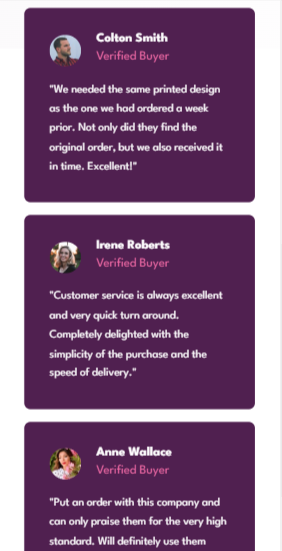
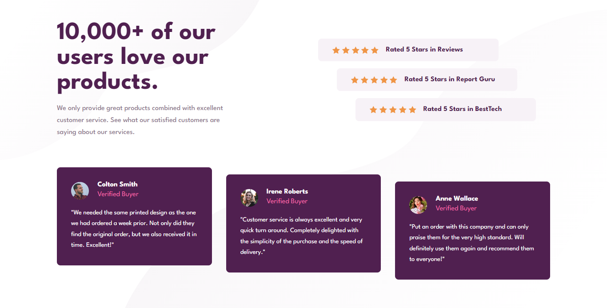

# Frontend Mentor - Social proof section solution

This is a solution to the [Social proof section challenge on Frontend Mentor](https://www.frontendmentor.io/challenges/social-proof-section-6e0qTv_bA). Frontend Mentor challenges help you improve your coding skills by building realistic projects. 

## Table of contents

- [Overview](#overview)
  - [The challenge](#the-challenge)
  - [Screenshot](#screenshot)
  - [Links](#links)
- [My process](#my-process)
  - [Built with](#built-with)
  - [What I learned](#what-i-learned)
  - [Useful resources](#useful-resources)
- [Author](#author)

## Overview

### The challenge

Users should be able to:

- View the optimal layout for the section depending on their device's screen size

### Screenshot

-Mobile version-





 -Desktop version




### Links

- Solution URL:  (https://your-solution-url.com)
- Live Site URL: (https://astonishing-dodol-63b160.netlify.app/)

## My process

### Built with

- Semantic HTML5 markup
- CSS custom properties
- Flexbox
- CSS Grid
- Mobile-first workflow

### What I learned

```css
.ratings-container {
        display: grid;
        place-content: center;
        padding: 2rem 2rem 2rem 6rem;
        grid-template-columns: repeat(12, 1fr);
    }

    .ratings-container > div:nth-child(1){
        grid-column: 1/11;
      }

      .ratings-container > div:nth-child(2){
        grid-column: 2/12;
      }

      .ratings-container > div:nth-child(3){
        grid-column: 3/-1;
      }
```

### Useful resources

- [Learn CSS Grid for free with Per Harald Borgen](https://scrimba.com/learn/cssgrid) - This helped me with positioning my divs.

## Author

- Frontend Mentor - [@Aboubakr06](https://www.frontendmentor.io/profile/Aboubakr06)
- Twitter - [@elbouzidi99](https://twitter.com/elbouzidi99)

